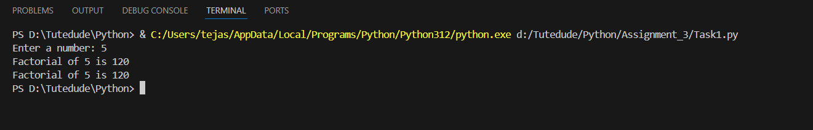
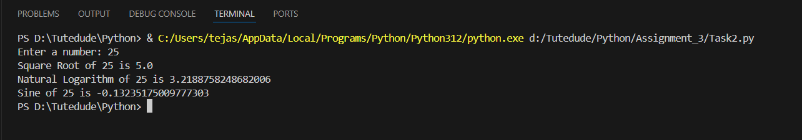

# Python Assignment

## Table of Contents
- [Assignment 1](#assignment-1)
- [Assignment 2](#assignment-2)
- [Assignment 3](#assignment-3)

## Assignment 1

### Task-1: Perform Basic Mathematical Operation
- Takes two numbers as input from the user
- Performs basic mathematical operations: Addition, Subtraction, Multiplication, Division
- **Output:**  
  

### Task-2: Create a Personalized Greeting
- Takes a user's first name and last name as input
- Concatenates the first name and last name into a full name
- Prints a personalized greeting message using the full name
- **Output:**  
  

## Assignment 2

### Task-1: Check if a Number is Even or Odd
- Takes an integer input from the user.
- Checks whether the number is even or odd using an if-else statement.
- Displays the result accordingly.
- **Output:**  

### Task-2: Sum of Integers from 1 to 50 Using a Loop
- Uses a for loop to iterate over numbers from 1 to 50.
- Calculates the sum of all integers in this range.
- Displays the final sum.
- **Output:**  

## Assignment 3

### Task-1: Calculate Factorial Using a Function
- Defines a function named factorial that takes a number as an argument and calculates its factorial using a loop or recursion.
- Returns the calculated factorial.
- **Output:**  

### Task-2: Using the Math Module for Calculations
- Asks the user for a number as input.
- Uses the math module to calculate the:
  - Square root of the number
  - Natural logarithm (log base e) of the number
  - Sine of the number (in radians)
- Displays the calculated results.
- **Output:**  

